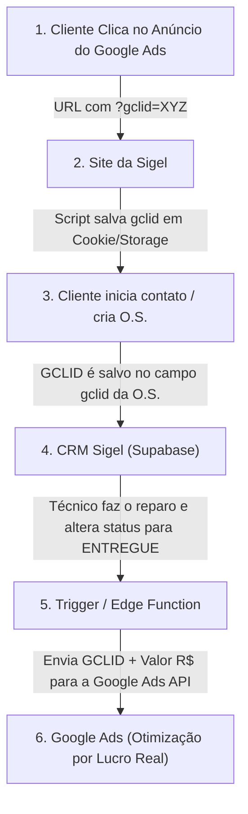

# Arquitetura Técnica & Prompt Mestre — CRM Sigel Informática

Este documento define a especificação completa de arquitetura, modelagem de dados e o **Prompt Estruturado por Etapas** para desenvolver o CRM próprio da **Sigel Soluções em Informática**, preparado para gestão de Ordens de Serviço (O.S.), Clientes, Automação de WhatsApp e Rastreamento de Conversões Offline do Google Ads (GCLID).

---

## 1. Visão Geral e Stack Tecnológica

| Camada | Tecnologia Escolhida | Justificativa Técnica |
| :--- | :--- | :--- |
| **Frontend** | **React (Vite) + TypeScript** | Desenvolvimento ultra-rápido, SPA leve, digitação estrita e ecossistema maduro. |
| **Estilização** | **Tailwind CSS + Lucide Icons** | Design moderno, responsivo, modo escuro nativo e fácil customização de temas. |
| **Gerenciamento de Estado** | **TanStack Query (React Query) + Zustand** | Caching de dados do banco, sincronização automática e estado global leve. |
| **Backend & BaaS** | **Supabase (PostgreSQL)** | Banco de dados relacional robusto, Autenticação, Realtime, Row Level Security (RLS) e Edge Functions. |
| **Integração Google Ads** | **Supabase Edge Functions + Google Ads API** | Envio de conversões offline utilizando o `GCLID` quando a Ordem de Serviço é concluída/paga. |
| **Automação WhatsApp** | **Evolution API / Z-API (Webhooks)** | Notificação automática ao cliente via WhatsApp quando a O.S. muda de status. |

---

## 2. Modelagem do Banco de Dados (Supabase / PostgreSQL)

```sql
-- 1. Tabela de Clientes
CREATE TABLE clientes (
    id UUID PRIMARY KEY DEFAULT gen_random_uuid(),
    nome VARCHAR(255) NOT NULL,
    telefone VARCHAR(20) NOT NULL,
    email VARCHAR(255),
    cpf_cnpj VARCHAR(20),
    endereco TEXT,
    bairro VARCHAR(100) DEFAULT 'Cristal',
    cidade VARCHAR(100) DEFAULT 'Porto Alegre',
    criado_em TIMESTAMPTZ DEFAULT NOW()
);

-- 2. Tabela de Equipamentos
CREATE TABLE equipamentos (
    id UUID PRIMARY KEY DEFAULT gen_random_uuid(),
    cliente_id UUID REFERENCES clientes(id) ON DELETE CASCADE,
    tipo VARCHAR(50) NOT NULL, -- Notebook, Desktop, Monitor, etc.
    marca VARCHAR(50) NOT NULL, -- Dell, Lenovo, HP, Acer, Apple, etc.
    modelo VARCHAR(100),
    numero_serie VARCHAR(100),
    senha_equipamento VARCHAR(100),
    criado_em TIMESTAMPTZ DEFAULT NOW()
);

-- 3. Tabela de Ordens de Serviço (O.S.)
CREATE TABLE ordens_servico (
    id UUID PRIMARY KEY DEFAULT gen_random_uuid(),
    numero_os SERIAL UNIQUE,
    cliente_id UUID REFERENCES clientes(id) ON DELETE RESTRICT,
    equipamento_id UUID REFERENCES equipamentos(id) ON DELETE RESTRICT,
    status VARCHAR(50) NOT NULL DEFAULT 'em_analise', 
    -- Status possíveis: 'em_analise', 'aguardando_aprovacao', 'aguardando_peca', 'em_manutencao', 'pronto', 'entregue', 'cancelado'
    defeito_relatado TEXT NOT NULL,
    laudo_tecnico TEXT,
    valor_mao_obra NUMERIC(10,2) DEFAULT 0.00,
    valor_pecas NUMERIC(10,2) DEFAULT 0.00,
    valor_total NUMERIC(10,2) GENERATED ALWAYS AS (valor_mao_obra + valor_pecas) STORED,
    forma_pagamento VARCHAR(50), -- Pix, Cartão, Boleto, Dinheiro
    origem_lead VARCHAR(50) DEFAULT 'google_ads', -- 'google_ads', 'organico', 'indicacao', 'balcao'
    gclid TEXT, -- Google Click Identifier (para conversão offline do Google Ads)
    previsao_entrega DATE,
    criado_em TIMESTAMPTZ DEFAULT NOW(),
    concluido_em TIMESTAMPTZ
);

-- 4. Tabela de Histórico de Status
CREATE TABLE historico_status (
    id UUID PRIMARY KEY DEFAULT gen_random_uuid(),
    os_id UUID REFERENCES ordens_servico(id) ON DELETE CASCADE,
    status_anterior VARCHAR(50),
    status_novo VARCHAR(50) NOT NULL,
    observacao TEXT,
    alterado_por UUID,
    criado_em TIMESTAMPTZ DEFAULT NOW()
);

-- 5. Fila de Conversões Offline do Google Ads
CREATE TABLE google_ads_conversions (
    id UUID PRIMARY KEY DEFAULT gen_random_uuid(),
    os_id UUID REFERENCES ordens_servico(id) ON DELETE CASCADE,
    gclid TEXT NOT NULL,
    valor_conversao NUMERIC(10,2) NOT NULL,
    status_envio VARCHAR(20) DEFAULT 'pendente', -- 'pendente', 'enviado', 'erro'
    resposta_api TEXT,
    criado_em TIMESTAMPTZ DEFAULT NOW(),
    enviado_em TIMESTAMPTZ
);
```

---

## 3. Fluxo de Rastreamento de GCLID e Conversão Offline (Google Ads)



---

## 4. PROMPT MESTRE ESTRUTURADO POR ETAPAS (Para Desenvolvimento com IA)

> **Instruções ao Desenvolvedor / IA:** Copie e execute uma etapa por vez para construir o CRM de forma modular e testada.

---

### 🔹 ETAPA 1: Setup do Projeto React + Tailwind + Supabase
```text
PROMPT ETAPA 1:
Atue como Engenheiro Frontend Sênior. Crie a estrutura inicial do CRM da Sigel Informática usando React (Vite), TypeScript e Tailwind CSS.

Requisitos da Etapa 1:
1. Configure o projeto Vite com React + TypeScript e instale os pacotes: @supabase/supabase-js, react-router-dom, lucide-react, clsx, tailwind-merge e @tanstack/react-query.
2. Crie o arquivo src/lib/supabase.ts inicializando o cliente Supabase com variáveis de ambiente (VITE_SUPABASE_URL e VITE_SUPABASE_ANON_KEY).
3. Crie um Layout Base com uma Sidebar retrátil moderna e elegante (Dark Mode padrão), contendo navegação para:
   - Dashboard
   - Ordens de Serviço (Kanban & Lista)
   - Clientes
   - Equipamentos
   - Relatórios Google Ads (GCLID)
   - Configurações
4. Crie o componente de Header com busca rápida global de O.S. e badge do usuário logado.
5. Garanta compilação limpa sem nenhum erro de TypeScript ou CSS.
```

---

### 🔹 ETAPA 2: Configuração do Banco de Dados e Autenticação no Supabase
```text
PROMPT ETAPA 2:
Atue como DBA e Especialista Supabase. Crie o script de migração SQL completo e as políticas de segurança.

Requisitos da Etapa 2:
1. Escreva o arquivo SQL contendo as 5 tabelas do CRM: clientes, equipamentos, ordens_servico, historico_status e google_ads_conversions (conforme modelo de schema relacional com chaves estrangeiras e índices).
2. Configure Row Level Security (RLS) para permitir acesso apenas a usuários autenticados da equipe da Sigel.
3. Crie uma Função/Trigger SQL em PostgreSQL que gera automaticamente um registro na tabela `historico_status` toda vez que a coluna `status` da tabela `ordens_servico` for alterada.
4. Crie uma página de Login (src/pages/Login.tsx) com validação visual de formulário e autenticação via Supabase Auth (E-mail e Senha).
```

---

### 🔹 ETAPA 3: Módulo de Clientes e Cadastros Rápidos
```text
PROMPT ETAPA 3:
Crie o módulo completo de Gestão de Clientes e Equipamentos.

Requisitos da Etapa 3:
1. Crie a tela `src/pages/Clientes.tsx` com tabela paginada, busca por nome/telefone/CPF e filtros rápidos.
2. Crie um Modal / Drawer de "Novo Cliente" com busca automática de CEP (ViaCEP API) e formatação/máscara automática de Telefone [(51) 9XXXX-XXXX] e CPF/CNPJ.
3. Dentro do perfil do cliente, permita visualizar a lista de Equipamentos cadastrados do cliente (Dell, Lenovo, HP, etc.) e o histórico de Ordens de Serviço anteriores.
4. Crie a busca preditiva de cliente ao abrir uma nova O.S., permitindo cadastrar cliente + equipamento na mesma tela em menos de 1 minuto.
```

---

### 🔹 ETAPA 4: Módulo Kanban & Gestão de Ordens de Serviço (O.S.)
```text
PROMPT ETAPA 4:
Crie a tela principal do CRM: O Quadro Kanban de Ordens de Serviço.

Requisitos da Etapa 4:
1. Crie a tela `src/pages/OrdensServico.tsx` com opção de alternar entre Visualização em Kanban (Drag and Drop ou botões de mover) e Visualização em Tabela detalhada.
2. Colunas do Kanban:
   - 🔍 Em Análise (Diagnóstico)
   - ⏳ Aguardando Aprovação
   - 🛠️ Em Manutenção
   - 🧩 Aguardando Peça
   - ✅ Pronto para Retirada
   - 🚀 Entregue & Concluído
3. Cada Card de O.S. no Kanban deve exibir: Número da O.S., Nome do Cliente, Modelo do Notebook, Valor Total, Badge de Garantia e Origem do Lead (Google Ads, Balcão, etc.).
4. Crie a tela de Impressão de Comprovante de O.S. (layout limpo em PDF/Impressão para o cliente assinar na bancada do Bairro Cristal com termos de garantia de 90 dias).
```

---

### 🔹 ETAPA 5: Automação WhatsApp & Notificações ao Cliente
```text
PROMPT ETAPA 5:
Implemente a integração com API do WhatsApp para aviso automático de status de O.S.

Requisitos da Etapa 5:
1. Crie um serviço helper `src/services/whatsapp.ts` integrado com Evolution API ou Z-API.
2. Quando a O.S. for alterada para "Pronto para Retirada", crie um botão de 1 clique ou disparo automático que envia a mensagem formatada para o cliente:
   "Olá [Nome], seu notebook [Modelo] está PRONTO para retirada na Sigel (Av. Icaraí, 1428 - Bairro Cristal)! Valor total: R$ [Valor]. Horário de atendimento: 09:30 às 18:30."
3. Permita personalizar os templates de mensagem nas configurações do CRM.
```

---

### 🔹 ETAPA 6: Motor de Conversão Offline do Google Ads (GCLID -> Revenue)
```text
PROMPT ETAPA 6:
Implemente o motor de rastreamento do GCLID e feedback de receita ao Google Ads.

Requisitos da Etapa 6:
1. Crie uma Supabase Edge Function (`process-google-conversion`) acionada via Webhook quando uma O.S. contendo a coluna `gclid` preenchida muda seu status para `entregue`.
2. A Edge Function deve inserir um registro em `google_ads_conversions` e enviar via HTTP POST para a Google Ads API / Conversion Upload Endpoint com os parâmetros:
   - `gclid`: ID único do clique
   - `conversion_action_id`: ID da ação no Google Ads
   - `conversion_value`: Valor total da O.S. (ex: 110.00 para formatação)
   - `conversion_date_time`: Data e hora da conclusão
3. Crie uma tela no CRM (`src/pages/RelatorioGoogleAds.tsx`) exibindo a lista de conversões enviadas, ROAS estimado por tipo de serviço e taxa de conversão da bancada.
```

---

## 5. Resumo e Próximos Passos
Com esta especificação salva na pasta `docs/crm_arquitetura_e_prompt.md`, você tem o blueprint completo de como criar o CRM próprio da Sigel sem desperdício de tempo ou retrabalho. 

Quando decidir iniciar o desenvolvimento do CRM, basta fornecer os prompts das Etapas 1 a 6 sequencialmente!
